# FocotServices
微服务与分布式计算架构服务群

## 服务架构

架构组成大体由作为数据呈现的前端层，进行存储和计算的核心层，以及从数据源收集数据的后端接入层，并通过前端/后端微服务的设计体系进行模块化结合，每个模块都彼此精密连接，并共同完成复杂的数据全生命周期管理。

### 前端

主要进行数据的呈现，为访问整个服务架构的入口，主要组件有

- 提供WebUI的数据中心前端页面
- 提供桌面APP的数据中心应用
- 为前端页面提供服务接入的API网关

### 应用层协议与数据格式

为前端服务接入提供应用协议的支持，并考虑到不同的数据传输场合

- HTTP/JSON协议形式，用于通用接口的交互传输，同时也应用于一些特殊的透传服务，这些服务数据大多格式不一，采用该形式便于维护
- WebSocket/ProtoBuf协议形式，用于数据批量传输的专用场合，减少频繁请求，并利用Proto格式优化数据体积

### 前端微服务层

是为前端服务提供支持的一系列微服务，位于API网关之后

- 请求代理服务，提供一些特殊的请求透传应用
- 数据中心服务，提供数据索引，鉴权，自定义配置等功能接口
- 数据中台，为海量数据建立抽象结构，组织并聚合数据湖中的数据，以标准化和结构化的形式提供给前端服务

### 存储与通讯

是存放数据的重要基础设施，为底层数据提供物理支持

- 时序数据库TimeScaleDB，是基于PostgreSQL的时序数据库，并兼容SQL标准，以时间为依据将海量数据进行分块，排序和管理，对这类按时间进行收集的数据存储有巨大优势
- 消息队列系统NATS，是一个集消息队列，服务请求应答，消息持久化，键值存储和对象存储为一体的多功能中间件，它可以无缝地在各个服务之间提供服务间调用，消息传递，消息存储服务，并将所有微服务体系结合起来

### 生态系统

是整个数据中心服务的核心部分，它实现了数据中心的主要功能：数据计算。生态系统由一个或多个复杂的微服务组成，有时甚至还包含一些特殊流程，生态系统不是一个独立的系统，相反是基于其他组件进行整合而来，它的扩展很大程度决定了整个服务的规模和功能

- 语音识别Whisper，由OpenAI开源的语音识别ASR大模型Whisper，可以对音视频数据提供识别服务，并将其转换为便于索引的文本数据
- 搜索引擎MeiliSearch，高响应速度的文本搜索引擎，便于从海量文本数据中提供数据的搜索，并关联相关信息
- 视频归档计划，针对一些视频进行下载存档，具有历史记录意义
- 数据计算服务，提供对数据进一步处理加工的各项能力

### 后端服务层

为系统提供丰富的数据，是数据中心观察外界的窗口

- 请求代理客户端，透传请求代理服务，将集中请求分散到各个边缘节点，以减少单点压力并实现负载均衡
- 数据收集服务，收集各项可供观测的数据
- 系统服务遥测，通过收集一些底层基础设施的监控数据，实时发现并反馈系统的异常，为长期稳定运行提供保障
